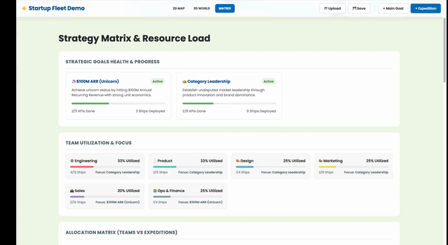

# StartupFleet - Strategic Visualization Platform

StartupFleet is an interactive, browser-based strategic management tool designed to visualize complex organizational goals, expeditions, and resource allocations in a gamified "Sea of Strategy" metaphor.

## 🌟 Key Features

*   **Dual Visualization Modes**:
    *   **2D Tactical Map**: A high-fidelity HTML5 Canvas view with infinite pan/zoom, drag-and-drop mechanics, and physics-based ship movement.
        
        

    *   **3D Horizon View**: A fully explorable Three.js world with dynamic waves, floating islands, volumetric clouds, and 3D orbiting satellites.

        

    *   **Strategy Matrix**: A comprehensive dashboard view for analyzing resource loading, team focus, and goal health.

        

*   **Strategic Hierarchy**:
    *   **North Star**: The ultimate guiding vision.
    *   **Main Goals**: High-level objectives leading to the North Star.
    *   **Expeditions (Islands)**: Specific projects or pillars supporting Main Goals.
    *   **KPIs**: Granular metrics tracking progress, visualized as orbiting satellites.
*   **Resource Management**: Drag-and-drop "Ships" (teams) onto Expeditions/KPIs to assign resources. Ships physically sail to their destinations.
*   **Physics Engine**: Custom steering behaviors ensure ships move organically, avoid collisions, and orbit their targets without overlapping.
*   **Interactive Tutorial**: A built-in guide for first-time users to master the controls and concepts.
*   **Persistence**: 
    *   **Auto-Save**: Changes are automatically saved to the backend (SQLite).
    *   **File Export/Import**: Save and load complete strategy states via local JSON files.
    *   **Customization**: Rename your project/fleet directly in the UI.

## 🛠️ Technical Architecture

### Frontend Stack
*   **Vanilla JavaScript (ES6 Modules)**: Core game logic, state management, and UI control. No heavy frameworks (React/Vue) were used to maintain high performance and simplicity.
*   **HTML5 Canvas API**: Powering the 2D rendering engine (`GameEngine.js`). Handles custom drawing of islands, ships, particles, and connection lines.
*   **Three.js**: Powering the 3D rendering engine (`ThreeEngine.js`). Used for the immersive perspective view with dynamic geometry (waves) and sprites.
*   **CSS3**: Glassmorphism UI design for a modern, clean aesthetic.

### Core Modules (`static/js/modules/`)

1.  **`GameEngine.js`**: The central controller.
    *   Manages the game loop (`requestAnimationFrame`).
    *   Handles Input (Mouse/Touch events for drag-and-drop, pan, zoom).
    *   **Physics Simulation**: Implements a custom force-based physics system for ship movement (Separation, Avoidance, Tethering).
    *   **State Management**: Loads/Saves JSON data structure.

2.  **`ThreeEngine.js`**: The 3D renderer.
    *   Syncs with `GameEngine` state to render 3D counterparts of 2D entities.
    *   **Dynamic Waves**: Modifies plane geometry vertices in real-time.
    *   **Text Rendering**: Generates dynamic textures from HTML Canvas.

3.  **`UIController.js`**: Manages the DOM overlay.
    *   Handles Modals (Edit/Create dialogs), Toast notifications, Dashboard Matrix view, and the Interactive Tutorial.

### Data Structure
The application state is a single JSON object:
```json
{
  "projectTitle": "My Startup Fleet",
  "teams": [ { "id": "t1", "name": "Engineering", "totalShips": 10, "deployed": [...] } ],
  "mainGoals": [ { "id": "mg1", "title": "Market Launch", "x": 0, "y": -600 } ],
  "islands": [
    {
      "id": "i1",
      "title": "Clinical Trials",
      "x": -200, "y": 0,
      "mainGoalIds": ["mg1"],
      "kpis": [ { "id": "k1", "desc": "Phase 1 Complete", "completed": false } ]
    }
  ]
}
```

## 🚀 Getting Started

1.  **Run the Backend**:
    The project uses Flask (Python) to serve files and handle persistence.
    ```bash
    # Install dependencies
    pip install -r requirements.txt
    
    # Run the server
    python3 app.py

    # Optional: Run on a specific port
    python3 app.py --port 8080
    ```

2.  **Open Browser**: Navigate to `http://localhost:8080` (or your custom port).

3.  **Interact**:
    *   **Tutorial**: Follow the on-screen tutorial to learn the basics.
    *   **Right-Click Drag**: Pan the map.
    *   **Scroll**: Zoom in/out.
    *   **Left-Click Drag**: Move Islands or Main Goals.
    *   **Drag Team Card**: Drag a team from the left sidebar onto an Island to deploy a ship.
    *   **Switch Views**: Use the top bar to toggle between 2D Map, 3D World, and Data Matrix.
    *   **Rename**: Click the "Startup Fleet" title in the top-left to rename your project.

## 🤝 Editing & Customization
*   **Add/Edit**: Click the "+ Expedition" or "+ Main Goal" buttons, or double-click existing items to edit their details and KPIs.
*   **Save/Load**: Use the Save/Upload buttons to keep your strategy file safe locally.

## 🎨 Visual Effects
*   **2D**: Parallax background grid, particle clouds, pulsating North Star, dashed connection lines.
*   **3D**: Vertex-displaced ocean waves, volumetric cloud clusters, floating diamond goals, bobbing ships.
